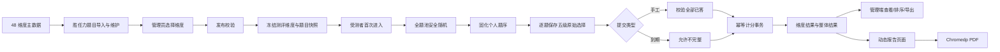

# 胜任力测验落地实施计划

**文档状态**：实施设计基线，尚未开始编码  
**需求基线**：[competency-assessment-requirements.md](competency-assessment-requirements.md)  
**题目数据状态**：48 个维度、384 道 AI 测试题已生成，仅供联调和验收，不作为正式人才决策量表  
**生产边界**：本计划只安排本地开发与 staging 验证；未得到用户明确“部署生产/上线”指令前，不发布生产

---

## 1. 结论与推荐落地方式

不建议在现有 001/002/003 逻辑中继续增加 `repoCode` 公式分支，也不建议一次性改完整条链路。胜任力测验应作为现有模块化单体中的一个**显式测评类型和独立业务分支**落地，并复用现有人员、测评、试卷、PDF 基础设施。

推荐顺序：

1. **数据基础、题目导入、纯计分引擎**；
2. **测评维度配置与发布冻结**；
3. **每人独立随机组卷、答题、手工/到期交卷**；
4. **管理端结果、排序和动态导出**；
5. **动态报告和 PDF**；
6. **完整回归、staging 验收，再决定生产发布**。

第一轮只实施第 1 阶段。每阶段独立编译、测试、验收并等待确认后再进入下一阶段，避免 Schema、API、前端、计分和报告同时大改。

---

## 2. 不可改变的业务规则

1. 48 个维度为独立主数据，管理员可选择任意一个或多个维度。
2. 选择维度后，必须纳入这些维度下**全部启用题目**；不按维度抽题。
3. 所有题目合并后执行一次全局纯随机；不做维度均衡穿插。
4. 每位受测者独立随机；试卷生成后题序永久固化。
5. 统一五级选项，不在每道题重复维护选项文本。
6. 正向题最终分为 1、2、3、4、5；反向题最终分为 5、4、3、2、1。
7. 每题且仅属于一个维度；考察点不参与计分。
8. 手工交卷要求全部作答；到期可自动提交未完成答卷。
9. 到期未答题不补分；维度只以已答题为分子和分母。
10. 零道已答的维度无有效得分，不进入整体得分和总体评价。
11. 维度得分为题目最终分平均值；整体得分为有效维度得分之和。
12. 总体评价用有效维度平均值按 1.00–5.00 等距四档判断，不改变整体得分口径。
13. 受测者默认只看完成提示，不看分数或报告；结果、答题明细和报告默认仅授权管理员可访问。
14. 已发布测评必须冻结维度、题目、考察点、方向、选项分值和版本；历史结果不得随题库变化。
15. 001/002/003 的组卷、计分、导出和报告行为保持原样。
16. 胜任力报告必须在测评配置阶段选择基层员工版或领导人员版；两个版本模板样式和模块完全一致，仅总体评价和发展建议文案不同，发布后版本冻结。

---

## 3. 已验证的现状与主要风险

### 3.1 现有实现事实

- `model.Exam` 没有显式 `assessmentType` 或 `scoringMode`。
- `model.Qu` 没有维度、维度内题号、考察点、方向和启停字段。
- `PaperHandler.createPaperTx` 当前按 `el_exam_repo` 的题型数量选题，并按题库顺序写入试卷。
- `PaperHandler.FillAnswer` 当前仅区分 002 与非 002；非 002 会进入“正确答案”语义。
- `TesterHandler.StandScore` 当前仅区分 002 与非 002；未知题库会误走 001 固定公式。
- `QuHandler.Save` 当前要求至少一个正确项，不符合胜任力五级量表“无正确答案”的语义。
- `QuHandler.ImportExcel` 当前没有维度、考察点、方向、启停和选项分值字段。
- 现有管理端和受测者端大量依赖 `repoCode` 前缀分流。
- 现有 001/002 报告使用 Vue 页面 + Chromedp，适合复用为动态胜任力报告。
- 数据库没有运行时 AutoMigrate；变更必须通过 `scripts/sql/` 下显式 SQL 执行。

### 3.2 必须先规避的风险

| 风险 | 后果 | 处理方式 |
|---|---|---|
| 胜任力被当成“非 002” | 误走 001 公式 | 使用显式 `assessment_type=competency` 和 `scoring_mode=competency_average` |
| 按显示题号推断维度 | 随机后计分错误 | 每个发布题目快照携带稳定维度关联 |
| 组卷时读取实时题库 | 历史试卷随题库变化 | 发布时冻结测评题目快照，组卷只读快照 |
| 使用 `ORDER BY RAND()` | 384 题及并发场景数据库开销高 | 一次查询全题，在 Go 中用安全随机源执行 Fisher–Yates |
| 为每题保存 5 份固定选项 | 384 题产生重复维护数据 | 选项由系统常量生成，仅在发布快照中保存选项及分值 JSON |
| 依赖前端倒计时交卷 | 浏览器关闭后不会提交 | 前端触发 + 后端过期扫描双保险 |
| 重复创建、重复交卷 | 两份试卷或两套结果 | 参与者行锁、试卷行锁、唯一索引和幂等状态检查 |
| 直接复用匿名 `/paper/paper/` 前缀 | 可能泄漏答卷或误调用旧逻辑 | 胜任力使用独立精确路由和试卷访问令牌；旧接口拒绝胜任力试卷 |
| 直接使用 384 道 AI 题上线 | 缺少信效度依据 | 数据标记为测试版；正式发布前必须人工审核和测量学验证 |

---

## 4. 目标业务链



---

## 5. 数据模型设计

### 5.1 兼容策略

- 保留现有 `el_qu`、`el_exam`、`el_paper`、`el_paper_qu`，只增加可空或有默认值的字段。
- 新增胜任力专属关联、快照、结果和报告表。
- 现有记录统一回填：
  - `assessment_type='legacy'`
  - `scoring_mode='legacy'`
  - `publish_status=1`（视为既有可用测评，不触发胜任力发布逻辑）
- 只有 `assessment_type='competency'` 才进入新链路。
- 不修改现有 001/002/003 数据含义，不把 48 个维度伪装成 48 个题库。

### 5.2 新表：`el_competency_dimension`

用途：48 个维度的唯一主数据。

| 字段 | 类型建议 | 说明 |
|---|---|---|
| `id` | varchar(64) PK | 稳定 ID |
| `code` | varchar(16) UNIQUE | `D01`～`D48` |
| `name` | varchar(100) UNIQUE | 维度名称 |
| `vird_level` | varchar(100) | Versatility / Integrity / Resilience / Drive 层级 |
| `applicable_category` | varchar(50) | 基层通用 / 管理通用 |
| `core_meaning` | varchar(500) | 核心含义 |
| `display_order` | int UNIQUE | 1～48 |
| `status` | tinyint | 0=启用，1=停用 |
| `create_time` / `update_time` | datetime | 审计时间 |

索引：

- `uk_competency_dimension_code(code)`
- `uk_competency_dimension_name(name)`
- `uk_competency_dimension_order(display_order)`
- `idx_competency_dimension_status_order(status, display_order)`

### 5.3 扩展 `el_qu`

仅胜任力题使用以下字段；既有题保持 NULL/默认值。

| 新字段 | 类型建议 | 说明 |
|---|---|---|
| `question_code` | varchar(32) NULL UNIQUE | 如 `D01-Q01`，全局稳定 |
| `dimension_id` | varchar(64) NULL | 关联维度 |
| `dimension_item_no` | int NULL | 维度内题号 |
| `observation_point` | varchar(255) NULL | 考察点，不计分 |
| `scoring_direction` | varchar(16) NULL | `forward` / `reverse` |
| `question_status` | tinyint NOT NULL DEFAULT 0 | 0=启用，1=停用 |

约束与索引：

- `uk_qu_question_code(question_code)`；MySQL 唯一索引允许既有记录保持多个 NULL。
- `uk_qu_dimension_item(dimension_id, dimension_item_no)`。
- `idx_qu_dimension_status(dimension_id, question_status)`。
- 应用层校验胜任力题必须具备上述必填值；非胜任力题不套用该校验。
- `el_qu_answer` 不为胜任力题重复保存五级固定选项。

### 5.4 扩展 `el_exam`

| 新字段 | 类型建议 | 说明 |
|---|---|---|
| `assessment_type` | varchar(32) NOT NULL DEFAULT 'legacy' | `legacy` / `competency` |
| `scoring_mode` | varchar(32) NOT NULL DEFAULT 'legacy' | `legacy` / `competency_average` |
| `competency_report_audience` | varchar(32) NULL | 胜任力必填：`frontline_employee` / `leader`；既有测评为 NULL |
| `publish_status` | tinyint NOT NULL DEFAULT 1 | 0=草稿，1=已发布；新胜任力测评默认 0 |
| `published_at` | datetime NULL | 首次成功冻结时间 |
| `published_by` | bigint NULL | 发布管理员 |

索引：`idx_exam_assessment_publish(assessment_type, publish_status)`。

说明：

- 现有 `state` 继续表达进行中、禁用、未开始、结束等运行状态。
- `publish_status` 只表达胜任力配置是否已经冻结，避免复用 `state` 造成语义冲突。
- 已发布胜任力测评只能编辑名称、开放时间、人员信息项等非题目范围字段；维度列表、题目快照和报告对象版本不可改变。
- `competency_report_audience` 使用独立字段，不复用现有 `stu_flag`；`stu_flag` 已承载 001/002 的学生版、职场版、基层员工版、管理干部版等历史语义，复用会导致类型耦合和错误报告分流。

### 5.5 新表：`el_exam_competency_dimension`

用途：草稿时保存维度选择；发布时写入维度元数据快照并锁定。

| 字段 | 说明 |
|---|---|
| `id` | PK |
| `exam_id` / `dimension_id` | 测评与源维度 |
| `dimension_code` / `dimension_name` | 发布快照 |
| `vird_level` / `applicable_category` | 发布快照 |
| `core_meaning` | 发布快照 |
| `display_order` | 参考工作簿顺序快照 |
| `question_count` | 发布时启用题数 |
| `create_time` / `snapshot_time` | 审计时间 |

唯一索引：`uk_exam_competency_dimension(exam_id, dimension_id)`。

### 5.6 新表：`el_exam_competency_question`

用途：已发布测评的不可变题目快照。组卷不得再读取实时题库内容。

| 字段 | 说明 |
|---|---|
| `id` | 快照 ID，PK |
| `exam_id` | 测评 ID |
| `exam_dimension_id` | 测评维度快照 ID |
| `source_qu_id` | 原题 ID，仅用于追溯 |
| `question_code` | 稳定题号快照 |
| `dimension_item_no` | 维度内题号快照 |
| `question_content` | 题干快照 |
| `observation_point` | 考察点快照 |
| `scoring_direction` | 方向快照 |
| `options_snapshot` | 五级选项、原始值和最终分值 JSON |
| `source_update_time` | 发布时原题更新时间 |
| `snapshot_order` | 发布快照的稳定顺序；组卷前使用，不是个人显示顺序 |
| `create_time` | 快照时间 |

唯一索引：

- `uk_exam_competency_question_source(exam_id, source_qu_id)`
- `uk_exam_competency_question_code(exam_id, question_code)`
- `idx_exam_competency_question_dimension(exam_id, exam_dimension_id)`

`options_snapshot` 示例：

```json
[
  {"rawValue":1,"label":"非常不符合","finalScore":1},
  {"rawValue":2,"label":"不太符合","finalScore":2},
  {"rawValue":3,"label":"一般","finalScore":3},
  {"rawValue":4,"label":"比较符合","finalScore":4},
  {"rawValue":5,"label":"非常符合","finalScore":5}
]
```

反向题的 `finalScore` 为 5、4、3、2、1。

### 5.7 扩展 `el_paper_qu`

| 新字段 | 类型建议 | 说明 |
|---|---|---|
| `exam_question_id` | varchar(64) NULL | 关联发布题目快照 |
| `raw_answer` | tinyint NULL | 受测者原始选择 1～5 |
| `final_score` | tinyint NULL | 服务器计算的最终分 1～5 |

索引和约束：

- `uk_paper_exam_question(paper_id, exam_question_id)`，保证每份试卷每道快照题恰好一次。
- `idx_paper_question_answered(paper_id, answered)`。
- 胜任力题的 `sort` 是个人随机显示顺序。
- `el_paper_qu_answer` 不为胜任力创建 5 份重复行。
- 胜任力展示题干、维度和方向一律从 `el_exam_competency_question` 读取，不再 JOIN 实时 `el_qu`。
- 为 `el_paper` 增加 `idx_paper_state_limit_time(state, limit_time)`，供到期 Worker 分批扫描。
- 胜任力的 `el_exam.total_score` 和 `el_paper.total_score` 保存理论上限 `5 × 已选维度数`；`qualify_score` 不参与胜任力判断。
- 现有 `obj_score`、`subj_score`、`user_score` 和 `el_user_exam.max_score` 都是整数且属于旧考试语义，胜任力不得用它们保存截断后的小数结果；完整成绩只写专属结果表。

### 5.8 新表：`el_competency_dimension_result`

用途：每份答卷的维度结果，作为页面、导出和报告的唯一计分事实来源。

| 字段 | 说明 |
|---|---|
| `id` | PK |
| `paper_id` | 试卷 |
| `exam_dimension_id` / `dimension_id` | 快照与源维度 |
| `dimension_code` / `dimension_name` / `display_order` | 结果快照 |
| `total_question_count` | 该维度总题数 |
| `answered_question_count` | 已答题数 |
| `score_sum` | 已答题最终分合计 |
| `dimension_score` | DECIMAL，零道已答时为 NULL |
| `level_code` | `low` / `average` / `good` / `high`，无得分时 NULL |
| `is_complete` | 该维度是否完整作答 |
| `create_time` | 计分时间 |

唯一索引：`uk_competency_dimension_result(paper_id, exam_dimension_id)`。

排序索引：`idx_competency_dimension_score(exam_dimension_id, dimension_score, paper_id)`，支持管理员按任一维度得分排序。

### 5.9 新表：`el_competency_result`

用途：每份答卷唯一整体结果。

| 字段 | 说明 |
|---|---|
| `paper_id` | PK |
| `exam_id` | 测评 |
| `total_question_count` / `answered_question_count` | 总完成度 |
| `effective_dimension_count` | 至少答 1 题的维度数 |
| `overall_score` | 有效维度得分之和，DECIMAL |
| `evaluation_average` | `overall_score / effective_dimension_count`；无有效维度时 NULL |
| `evaluation_level` | 等距四档；无有效维度时 NULL |
| `report_audience` | 从已发布测评复制的 `frontline_employee` / `leader` 快照 |
| `is_complete` | 是否完整作答 |
| `submit_type` | `manual` / `timeout` |
| `scoring_version` | 初版固定 `competency-v1` |
| `submitted_at` | 首次完成时间，不允许重复覆盖 |
| `create_time` / `update_time` | 审计时间 |

索引：`idx_competency_result_exam_score(exam_id, overall_score, paper_id)`，支持同一测评按整体得分分页排序。

### 5.10 报告阶段新增表

#### `el_competency_report_text`

存储客户提供的正式文案、内容版本和启停状态：

- 总体评价：`report_audience + evaluation_level + content_version`；
- 发展建议：`report_audience + dimension_id + level_code + content_version`；
- 分维度结果解读和典型行为如两个版本共用，可将 audience 设计为 `common`；如客户后续要求区分，可使用同一匹配机制扩展。

没有目标版本正式文案时只允许生成带“测试版/文案待配置”标识的非生产报告；生产生成必须报出缺失版本及文案项，不得回退到另一版本。

#### `el_competency_report`

保存 `paper_id`、报告对象版本快照、内容版本、生成状态、文件路径、是否部分渲染、错误摘要和生成时间。生成成功后同步现有 candidate/tester 的 `pdf_path`、`pdf_flag`，保持当前下载功能兼容。

### 5.11 迁移文件规划

| 文件 | 作用 |
|---|---|
| `scripts/sql/competency_001_schema.sql` | 新表、字段、索引、既有数据回填 |
| `scripts/sql/competency_002_dimensions.sql` | 幂等写入 D01～D48 主数据 |
| `scripts/sql/competency_003_questions.sql` | 幂等扩展胜任力题目主数据字段和索引 |
| `scripts/sql/competency_004_report_tables.sql` | 报告表，进入报告阶段再执行 |
| `scripts/data/competency-test-questions.json` | 384 道测试题的规范化中间数据 |
| `scripts/data/competency-test-questions.xlsx` | 通过正式导入接口使用的测试数据 |
| `scripts/tools/build-competency-question-fixture.js` | 从 12 份 Markdown 审阅稿生成并校验 JSON/XLSX |

迁移要求：

- 不调用 `AutoMigrate`。
- 兼容 MySQL 5.7；新增列通过 `information_schema` + 动态 SQL 做幂等检查。
- `CREATE TABLE IF NOT EXISTS`；种子数据使用稳定 ID 和 `INSERT ... ON DUPLICATE KEY UPDATE`，不删除客户数据。
- 迁移前备份；本地执行后用 SQL 核对表、列、索引、48 条维度及 D42“权力动机”。
- SQL 的 UPDATE/DELETE 必须带主键或索引条件，遵守 Safe Update Mode。

---

## 6. 计分引擎

### 6.1 单题换算

设原始选择为 $r \in \{1,2,3,4,5\}$：

$$
s =
\begin{cases}
r, & \text{正向题} \\
6-r, & \text{反向题}
\end{cases}
$$

客户端只提交 `rawValue`；最终分由服务器根据发布快照中的方向计算，拒绝客户端提交或覆盖 `finalScore`。

### 6.2 维度与整体得分

对于第 $k$ 个维度：

$$
D_k = \frac{\sum_{i=1}^{n_k}s_i}{n_k}
$$

其中 $n_k$ 只统计已答题。若 $n_k=0$，则该维度得分为 NULL。

整体得分：

$$
T = \sum_{k=1}^{m}D_k
$$

总体评价均值：

$$
E = \frac{T}{m}
$$

其中 $m$ 是有效维度数。

### 6.3 精度策略

- 内部保留 `score_sum / answered_count` 的整数分子和分母。
- 纯函数使用有理数或等价的不提前取整算法求和。
- 持久化 DECIMAL 至少保留 6 位小数；页面、导出、报告统一显示两位小数。
- 不在逐题或逐维度阶段先四舍五入再求整体得分。
- 页面、导出和报告只读取已保存的同一套结果，不各自重复实现公式。

### 6.4 纯函数边界

建议新增：

- `calculateQuestionScore(rawValue, direction)`
- `calculateCompetencyResult(questionResults)`
- `competencyLevel(score)`
- `formatCompetencyScore(score)`

这些函数不访问 HTTP 或数据库，先用表驱动测试固定行为，再接入 Handler。

---

## 7. 发布冻结与组卷算法

### 7.1 草稿保存

胜任力测评保存时：

1. 校验 `assessmentType=competency` 与 `scoringMode=competency_average` 成对出现；
2. 必须选择 `competencyReportAudience=frontline_employee` 或 `leader`；
3. 至少选择 1 个维度；
4. 维度必须存在且启用；
5. 每个维度至少有 1 道启用题；
6. 保存 `el_exam` 与 `el_exam_competency_dimension` 草稿选择；
7. 返回各维度启用题数和总题数预览；
8. 不创建题目快照。

### 7.2 发布

独立发布接口在一个事务中：

1. 锁定测评行；
2. 已发布则幂等返回现有快照摘要，不重建；
3. 重新校验维度和启用题；
4. 按维度默认顺序、维度内题号查询全部启用题；
5. 校验题目编号唯一、维度一致、方向合法、题干非空；
6. 批量写入维度和题目快照；
7. 写入统一五级选项及最终分值 JSON；
8. 更新 `publish_status=1`、`published_at`、`published_by`；
9. 将报告对象版本作为发布配置冻结；
10. 提交后禁止修改维度、题目快照和报告对象版本。

发布失败必须整体回滚并返回可处理的具体错误，例如“D17 没有启用题目”或“D03-Q02 计分方向非法”。

### 7.3 每人独立随机组卷

1. 验证参与者身份、测评状态和已发布状态；
2. 对 candidate/tester 对应行加 `FOR UPDATE` 锁；
3. 已有进行中试卷则返回原试卷和新签发的试卷访问令牌，不创建第二份；
4. 已完成则返回“已完成”，不创建第二份；
5. 一次查询全部发布题目快照；
6. 复制切片后使用 `crypto/rand` 驱动 Fisher–Yates：

$$
\text{for } i=n-1\ldots1,\quad j\in[0,i],\quad swap(i,j)
$$

7. 安全随机源失败则整个事务失败，不写入半份试卷；
8. 批量写入 `el_paper` 和 `el_paper_qu`；`sort` 为 1～N 的个人固定题序；
9. 更新 candidate/tester 的 `paper_id`；
10. 返回试卷 ID 和短期、限定 paper/participant/exam 的访问令牌。

验收随机机制时验证“每份都独立执行洗牌、集合完整、无重复、刷新顺序不变”，不要求任意两份试卷必然不同。

---

## 8. 答题、超时与幂等提交

### 8.1 试卷访问令牌

胜任力匿名答题接口不复用当前宽泛匿名前缀。建议：

- 封闭测评：tester 登录成功后签发参与者 JWT；
- 开放测评：candidate 信息保存成功后签发参与者 JWT；
- 创建/恢复试卷后再签发只允许访问指定 `paperId` 的试卷 JWT；
- 每个胜任力答题请求都校验令牌中的 participant、exam、paper 和 purpose；
- 管理结果、导出和报告接口只接受后台管理员 JWT。

参与者 API 永远不返回维度、计分方向、最终得分、维度结果或整体结果，只返回答题所需题干、固定五级选项、进度和完成状态。

### 8.2 保存答案

请求只包含：

```json
{
  "paperId": "...",
  "paperQuestionId": "...",
  "rawValue": 4
}
```

服务器校验：

1. 试卷访问令牌匹配；
2. 试卷存在且状态为进行中；
3. 题目属于该试卷；
4. `rawValue` 为 1～5；
5. 当前时间未超过服务端 `limit_time`；
6. 从发布快照读取方向，服务器计算最终分；
7. 使用 `Updates()` 更新 `raw_answer`、`final_score`、`answered`；
8. 返回新的已答数量，不返回得分。

超时后收到保存请求时，服务器先执行一次幂等超时交卷，再返回“测评已到期并提交”。

### 8.3 手工交卷

- 锁定 `el_paper` 行；
- 已完成时直接返回首次结果摘要，不重复计算、不覆盖时间；
- 校验已答数等于总题数，否则拒绝并返回第一道未答题的显示序号；
- 在同一事务计算并写入 1 条整体结果和 N 条维度结果；
- 更新试卷状态、candidate/tester 的 `end_time`；
- 返回“提交成功”和完成时间，不向参与者返回分数。

### 8.4 到期自动提交

双保险：

1. 前端倒计时归零立即请求 `submitType=timeout`，失败后按有限退避重试并明确显示状态；
2. 后端启动过期扫描 Worker，周期查询 `state=进行中 AND limit_time<=NOW()` 的胜任力试卷，分批调用同一提交服务。

Worker 要求：

- 扫描间隔和批大小通过配置注入；
- `router.Setup` 启动，shutdown 钩子停止；
- 每份试卷独立事务和行锁；
- 与前端同时触发时只产生一套结果；
- 单份失败记录结构化错误，不阻塞其他试卷；
- 增加 `(state, limit_time)` 索引，避免全表扫描。

---

## 9. API 契约规划

统一使用现有 `response.Rest()` 协议：成功 `code=0`，列表永远返回 `[]` 而不是 `null`。

### 9.1 管理员 API

| 方法与路径 | 用途 | 权限 |
|---|---|---|
| `POST /exam/api/competency/dimensions/paging` | 维度分页/状态/题数 | 管理员 |
| `POST /exam/api/competency/dimensions/state` | 启停维度 | 管理员 |
| `POST /exam/api/competency/questions/paging` | 按维度、状态、题号查询 | 管理员 |
| `GET /exam/api/competency/questions/import-template` | 下载无合并单元格模板 | 管理员 |
| `POST /exam/api/competency/questions/import-preview` | 校验文件并返回成功/失败行、SHA-256 | 管理员 |
| `POST /exam/api/competency/questions/import` | 重传同一文件、核对 SHA-256、再次校验并导入 | 管理员 |
| `POST /exam/api/competency/exams/question-count` | 根据维度列表预览各维度及总题数 | 管理员 |
| `POST /exam/api/competency/exams/publish` | 冻结维度和题目范围 | 管理员 |
| `POST /exam/api/competency/results/paging` | 按整体或指定维度排序 | 管理员 |
| `POST /exam/api/competency/results/detail` | 个人整体、维度、逐题审计详情 | 管理员 |
| `GET /exam/api/competency/admin/report-data` | 管理端报告页面数据 | 管理员 |
| `GET /exam/api/competency/internal/report-data` | Chromedp 专用，仅内部令牌 | 精确匿名 + 内部令牌二次校验 |

现有接口同步扩展：

- `/exam/api/exam/exam/save`：接受 `assessmentType`、`scoringMode`、`dimensionIds`。
- `/exam/api/exam/exam/detail`：返回上述字段、`publishStatus`、维度列表和题数摘要。
- `/exam/api/exam/exam/paging`、`online-paging`：返回 `assessmentType`、`publishStatus`。
- `/exam/api/exam/exam/export-raw-data`、`export-raw-answers`：按 `assessmentType` 进入胜任力动态导出。
- `/exam/api/exam/exam/generate-report`：按 `assessmentType` 进入胜任力报告页，不再仅按 `repoCode`。

### 9.2 参与者 API

| 方法与路径 | 用途 | 返回边界 |
|---|---|---|
| `POST /exam/api/competency/participant/create-paper` | 首次创建或幂等恢复 | paperId、paperToken、状态，不返回得分 |
| `POST /exam/api/competency/participant/paper-detail` | 加载固定题序和已答选择 | 题干、固定选项、原始选择、进度、服务端时间 |
| `POST /exam/api/competency/participant/fill-answer` | 保存单题原始选择 | 已答数量、保存状态，不返回最终分 |
| `POST /exam/api/competency/participant/submit` | 手工或到期提交 | 完成状态、完整性、完成时间，不返回结果 |

这些路径采用精确匿名白名单，Handler 内必须再校验参与者/试卷令牌。不存在匿名结果 API。

### 9.3 关键响应结构

试卷详情：

```json
{
  "paperId": "...",
  "assessmentType": "competency",
  "state": "in_progress",
  "serverTime": "2026-01-01T10:00:00+08:00",
  "limitTime": "2026-01-01T11:00:00+08:00",
  "totalCount": 384,
  "answeredCount": 120,
  "unansweredCount": 264,
  "questions": [
    {
      "id": "paper-question-id",
      "sort": 1,
      "code": "D17-Q04",
      "content": "...",
      "answered": true,
      "rawValue": 4,
      "options": [
        {"value": 1, "label": "非常不符合"},
        {"value": 2, "label": "不太符合"},
        {"value": 3, "label": "一般"},
        {"value": 4, "label": "比较符合"},
        {"value": 5, "label": "非常符合"}
      ]
    }
  ]
}
```

管理员结果详情额外返回：

- `isComplete`、`submitType`、总体完成率；
- `overallScore`、`evaluationAverage`、`evaluationLevel`；
- 按 1～48 默认顺序排列的维度结果；
- 逐题 `dimensionCode`、`direction`、`rawValue`、`finalScore` 和题目快照。

---

## 10. 题目导入设计

### 10.1 模板列

每一题一行，不使用合并单元格：

1. 维度序号；
2. 维度名称；
3. 题目编号；
4. 维度内题号；
5. 题目内容；
6. 考察点；
7. 计分方向（正向/反向）；
8. 启用状态；
9. 备注（可空）。

### 10.2 两步导入

1. **预览**：解析全部行，返回成功行、失败行、具体原因和文件 SHA-256，不写数据库。
2. **正式导入**：管理员确认后重传文件和预览 SHA-256；服务器核对文件未变化并重新校验。
3. 默认存在任一错误时禁止正式导入；如产品后续需要“只导入有效行”，必须增加显式确认参数，并确保错误行永不写入。
4. 正式导入用单事务和 `CreateInBatches`；任一数据库错误整体回滚。

### 10.3 校验规则

- 维度序号 1～48；
- 维度名称与主数据完全一致；
- 题目编号全局唯一，文件内部也唯一；
- 维度内题号为正整数且维度内唯一；
- 题干和考察点非空；
- 方向只能是正向/反向；
- 状态只能是启用/停用；
- 不校验“每维度必须 7～8 题”，也不对此发警告；
- 测试数据写入 `remark=AI测试题-未信效度验证`。

---

## 11. 前端设计

### 11.1 测评配置页

修改现有测评表单：

- 增加显式测评类型：心理特质、管理特质、MBTI、胜任力；
- 选择胜任力后隐藏传统“题数 × 单题分”表格；
- 选择胜任力后显示必选的“报告版本”：基层员工版、领导人员版；默认不替管理员选择，避免误用报告文案；
- 在报告版本选择项旁明确提示：两个版本模板与模块一致，仅总体评价和发展建议文案不同；
- 展示 48 维度分组选择器，支持全选基层通用、管理通用或某个 VIRD 层级；
- 每个维度显示启用题数；顶部实时显示已选维度数和总题数；
- 至少选择 1 个维度；零启用题维度禁选并显示原因；
- 胜任力的受测者报告开关默认关闭；
- 已发布后维度选择和报告版本均只读，显示冻结时间和题目快照数；如需另一版本，应复制为新测评；
- 增加独立“发布并冻结题目”动作，不把普通保存等同于发布。

### 11.2 题目管理页

- 胜任力题显示题目编号、维度、维度内题号、题干、考察点、方向、状态；
- 不要求管理员维护五个固定选项；
- 正向/反向只显示方向，不使用“正确项/锚点”术语；
- 增加胜任力专用导入模板、预览和确认弹窗；
- 已进入发布快照的源题仍可为未来测评编辑或停用，但界面提示“不会影响已发布测评”。

### 11.3 独立答题页

建议新增 `competencyExam.vue`，不把 384 题逻辑塞入现有滚动页或点击页。

交互：

- 单题卡片 + 五级选择；
- 顶部显示当前题号、总题数、已答、未答、进度和服务端倒计时；
- 上一题、下一题、题号导航和“定位第一道未答”；
- 选择后立即保存，显示保存中/已保存/失败重试；
- 刷新后恢复服务器题序和答案；
- 手工交卷时未完成则定位首个未答；
- 到期触发提交，网络失败保留页面状态并重试，不能静默跳转；
- 完成后统一进入感谢页，不展示结果。

384 题场景采用分页/虚拟题号导航或折叠分段，避免一次渲染 384 个复杂卡片 DOM。

### 11.4 管理端结果

在现有受测者列表中：

- 增加胜任力整体得分、完成率、完整性状态；
- 增加一个维度筛选器，允许按任一已测维度升/降序；
- 详情抽屉按默认维度顺序展示题数、已答数、得分合计、维度分、等级；
- 逐题审计详情展示原始选择、方向和最终分；
- 报告组件按 `assessmentType` 分流，不再让未知类型默认渲染 001 报告。

### 11.5 动态报告页

建议新增独立 `competencyReport.vue`：

- 封面；
- 阅读说明；
- 按测评配置展示基本信息；
- 总体评价与完整性提示；
- 只展示本次有效维度的动态柱状图/雷达图；
- 按维度默认顺序生成分维度结果块；
- 发展建议；
- 设置 `window.__reportReady` / `window.__reportIncomplete` 供 Chromedp 判断。

报告组件只有一份，不复制两套 Vue 模板。组件从结果/报告快照读取 `reportAudience`，使用同一布局和模块渲染；总体评价和发展建议通过 audience-aware 文案 API 获取。这样可以从结构上保证两个版本样式、模块、得分和图表一致。

客户正式文案未交付前：

- 可完成布局、数据、图表和测试 PDF；
- 只能展示核心含义和“正式解读文案待配置”；
- 不自动编造生产版分级解读、典型行为和发展建议；
- 不通过生产报告验收门禁。

---

## 12. 动态导出设计

胜任力不适合沿用 001/002 固定维度列模板。建议输出一个动态工作簿：

### Sheet 1：`结果汇总`

- 受测者基本信息；
- 开始/完成时间、答题时长、完成率、完整性；
- 整体得分、总体评价均值和等级；
- 本次所选维度动态列，按 1～48 默认顺序。

### Sheet 2：`逐题明细`

每行一名受测者的一道题：

- 受测者 ID/姓名；
- 个人显示题序；
- 稳定题目编号和题干快照；
- 维度编号/名称；
- 考察点；
- 计分方向；
- 原始选择值和文本；
- 最终题目得分；
- 是否作答。

### Sheet 3：`题目字典`

- 发布题目快照的完整元数据；
- 用于人工复核，不受个人随机题序影响。

导出只读已保存结果和发布快照，不重新计算公式。现有两个导出按钮可对胜任力调用同一个动态导出构建器，对 001/002/003 保持原实现。

---

## 13. 后端改动范围

### 13.1 新增文件（规划）

| 位置 | 职责 |
|---|---|
| `internal/model/competency.go` | 胜任力维度、快照、结果、报告模型 |
| `internal/repository/competency.go` | 胜任力批量查询、事务锁、结果持久化 |
| `internal/service/competency.go` | 发布、组卷、保存、提交的业务编排 |
| `internal/service/competency_scoring.go` | 无数据库依赖的纯计分函数 |
| `internal/service/competency_worker.go` | 到期自动提交 Worker |
| `internal/handler/competency_admin.go` | 维度、题目、发布、结果管理接口 |
| `internal/handler/competency_import.go` | Excel 模板、预览、导入 |
| `internal/handler/competency_paper.go` | 参与者创建/恢复、详情、答题、提交 |
| `internal/handler/competency_export.go` | 动态三 Sheet 导出 |
| `internal/handler/competency_report.go` | 报告数据和报告生成分支 |

新模块采用 Handler → Service → Repository，避免继续扩大现有 `paper.go`、`exam.go` 和 `exam_pdf.go`。

### 13.2 修改现有文件（规划）

| 文件 | 同步修改 | 理由 |
|---|---|---|
| `internal/model/business.go` | `Exam`、`Qu`、`PaperQu` 增加兼容字段 | 现有公共模型要读取新增列 |
| `internal/handler/exam.go` | 保存/详情/分页返回显式类型和维度配置；删除时清理无业务数据的胜任力配置 | 测评配置消费方需要 |
| `internal/handler/qu.go` | 胜任力题校验走独立语义；详情/分页返回新字段 | 不再要求“正确项” |
| `internal/handler/paper.go` | 旧接口识别并拒绝胜任力试卷，防止误走旧组卷/计分/结果分支 | 隔离 001/002/003 与胜任力 |
| `internal/handler/tester_list.go`、`tester.go`、`candidate.go` | 管理列表返回 `assessmentType`、胜任力结果摘要 | 前端管理列表分流 |
| `internal/handler/exam_pdf.go` | 在入口按 `assessmentType` 调用胜任力动态导出 | 保持现有下载入口 |
| `internal/handler/exam_report_gen.go` | 报告路由先按 `assessmentType`，胜任力走新 Vue 报告 | 未知类型不能默认 001 |
| `internal/router/router.go` | 装配 Repository/Service/Handler/Worker，注册精确路由和 shutdown | 新模块入口 |
| `internal/middleware/middleware.go` | 精确匿名答题路径；管理/结果接口必须 JWT；内部报告端点二次令牌 | 满足 REQ-068 |
| `internal/config/config.go` 和配置 YAML | 自动提交扫描间隔、批大小；复用现有报告内部令牌 | 禁止环境/运行参数硬编码 |
| `pkg/pdfgen/pool.go` | 增加可选额外请求头的渲染方法，旧 `GeneratePDF` 保持兼容包装 | 内部报告数据安全加载 |

### 13.3 明确无需修改

| 项目 | 结论 |
|---|---|
| `Legacy Java System/` | 只读，绝不修改 |
| 001/002 固定公式内容 | 不修改；胜任力不调用这些函数 |
| MBTI DOCX 模板与计分 | 不修改 |
| 现有 candidate/tester 表结构主体 | 继续复用；只同步结果完成时间和 PDF 字段 |
| 现有普通答题页面 | 不承载胜任力，保持原行为 |
| 现有固定导出模板 | 001/002/003 继续使用，胜任力独立动态导出 |

---

## 14. 前端改动范围

### 14.1 修改现有文件

| 文件 | 同步修改 |
|---|---|
| `src/views/exam/exam/form.vue` | 显式测评类型、维度选择、题数预览、发布冻结状态 |
| `src/views/exam/exam/index.vue` | 显示 `assessmentType`、发布状态，胜任力不再显示学生版/职场版 |
| `src/views/qu/qu/index.vue` | 胜任力列和导入入口 |
| `src/views/qu/qu/form.vue` | 维度、考察点、方向、状态；隐藏正确项/固定选项维护 |
| `src/views/paper/exam/list.vue` | QR/入口携带并优先使用 `assessmentType` |
| `src/views/paper/exam/candidate.vue` | 保存后持有参与者令牌 |
| `src/views/paper/exam/tester.vue` | 登录后持有参与者令牌 |
| `src/views/paper/exam/preview.vue` | 胜任力调用幂等创建/恢复并跳独立答题页 |
| `src/views/user/exam/index.vue` | 胜任力结果摘要、维度排序、详情、报告组件分流 |
| `src/router/index.js` | 胜任力答题和管理报告路由 |
| `src/api/exam/exam.js`、`src/api/qu/qu.js`、`src/api/paper/exam.js` | 新增胜任力 API 封装，旧导出保持 |

### 14.2 新增文件

| 文件 | 职责 |
|---|---|
| `src/views/paper/exam/competencyExam.vue` | 独立答题、进度、保存队列、到期重试 |
| `src/views/paper/exam/competencyReport.vue` | 动态管理报告及 Chromedp 页面 |
| `src/views/exam/exam/components/CompetencyDimensionSelector.vue` | 48 维度分组选择和题数预览 |
| `src/views/qu/qu/components/CompetencyImportDialog.vue` | 导入预览、错误行和确认 |
| `src/api/competency/index.js` | 胜任力管理和参与者 API |

### 14.3 现有 API 消费方兼容

- `createPaper`、`paperDetail`、`paperQuDetail`、`fillAnswer`、`handExam`、`paperResult` 的旧前端消费方保持不变。
- 胜任力答题页只调用新 API，不改变旧 API 请求/返回结构。
- `Exam` 详情/分页只增加字段，旧组件不读取这些字段时行为不变；读取 `repoCode` 的页面要同步优先判断 `assessmentType`。
- 胜任力 `Exam` 详情/分页同步返回 `competencyReportAudience`；旧测评返回 NULL，不能从 `stuFlag` 推断胜任力报告版本。
- 管理端报告弹窗必须增加胜任力分支，不能让 `v-else` 默认落入 001 报告。

---

## 15. 测试策略和质量门禁

### 15.1 编码前账本

新增任何 Handler 前，先在 `docs/business-branches.md` 补充分支矩阵，至少包括：

- 维度启停、空题维度、重复维度；
- 导入成功/失败/混合/重复题号/非法方向；
- 草稿/已发布/重复发布；
- 首次组卷/重复进入/已完成/随机源失败；
- 正向 1～5、反向 1～5、空答案、越界答案；
- 手工完整/手工不完整/到期完整/到期不完整/零有效维度；
- 前端与 Worker 并发交卷；
- 管理员/参与者/无令牌/错 paper 令牌；
- 报告文案完整/缺失、报告生成失败。

### 15.2 Go 单元测试

建议新增：

- `competency_scoring_test.go`
  - 正向和反向 10 个映射；
  - 维度平均；
  - 多维度整体和评价均值；
  - 零已答维度；
  - 不完整答卷；
  - 随机题序不影响结果；
  - 重复计分确定性。
- `competency_shuffle_test.go`
  - 集合完整、无重复、排序固化；
  - 注入确定性随机源；
  - 随机源错误不产生半份数据。
- `competency_publish_test.go`
  - 空维度、停用维度、零启用题、非法题、重复发布。
- `competency_paper_test.go`
  - 并发创建只产生一份试卷；
  - 令牌隔离；
  - 答案越界；
  - 手工未答拒绝；
  - 超时允许不完整；
  - 并发提交只产生一套结果。
- `competency_import_test.go`
  - 空字符串、缺列、维度不一致、重复编号、方向非法、事务回滚。
- 中间件测试
  - 胜任力管理、结果、导出、报告管理端点必须非匿名；
  - 参与者端点精确匿名但无业务令牌仍被 Handler 拒绝；
  - 旧管理 `paging/delete/review-paper` 不因宽泛前缀匿名。

### 15.3 前端 Vitest

- 维度选择与题数统计；
- 已发布只读；
- 384 题时答题页不一次渲染全部复杂卡片；
- 保存成功、失败重试和刷新恢复；
- 手工交卷未答定位；
- 到期提交失败不静默丢状态；
- 完成后只到感谢页；
- 报告只渲染已测有效维度；
- `window.__reportReady` / `__reportIncomplete`。

### 15.4 API 与浏览器验收

- 使用 3 个维度做快速端到端链；
- 使用全部 48 维度、384 题做容量链；
- 创建至少 100 份试卷验证每份集合完整和独立执行随机化；
- 刷新、重登和断点续答后题序 100% 不变；
- 人工构造已知答案，页面、SQL、导出、报告逐项一致；
- 修改/停用源题后，已发布测评和历史试卷不变；
- 未登录、参与者令牌和管理员令牌做越权矩阵测试；
- 前端关闭后由 Worker 完成到期提交；
- 报告失败不改变答卷和结果。

### 15.5 每阶段完成门禁

每阶段必须同时满足：

1. `Go: Build` 零错误；
2. `Go: Test All` 全部通过；
3. `Frontend: Vitest (run once)` 全部通过（涉及前端时）；
4. 该阶段新增测试通过；
5. 涉及运行时行为时执行真实 API/浏览器调用；
6. 涉及数据库时用 SQL 查询核对数据、唯一索引和事务结果；
7. 001/002/003 快速回归通过；
8. 更新 `docs/business-branches.md`；Bug 修复时同步 `docs/regression-tests.md`；
9. 结果证据记录后才进入下一阶段。

---

## 16. 分阶段任务与需求映射

### 阶段 1A：安全与分流基线

目标：保证新类型不会误走旧公式、旧公开前缀不能暴露新答卷。

任务：

- 增加显式测评类型常量和分流测试；
- 新增胜任力 API 的精确匿名/管理权限规则；
- 旧 paper API 对胜任力试卷返回明确错误；
- 为参与者令牌和试卷令牌定义 claims 与校验器；
- 先补分支矩阵和权限测试。

覆盖：REQ-065、REQ-066、REQ-068、REQ-069。

### 阶段 1B：Schema、48 维度、题目导入、计分纯函数

任务：

- 编写并本地执行 `competency_001_schema.sql`；
- 编写并执行 `competency_002_dimensions.sql`；
- 新增模型、Repository 基础查询；
- 实现题目模板、预览和正式导入；
- 生成 384 道测试题 JSON/XLSX；
- 实现并测试单题、维度、整体和分档纯函数；
- SQL 验证 48 维度、唯一索引和 D42 名称。

覆盖：REQ-001～REQ-017、REQ-038～REQ-044 的纯函数部分、REQ-067、REQ-069；SC-001、SC-005、SC-006 的单元级证据。

**第一阶段必须按 1A → 1B 执行，不同时进入测评配置页面、答题页面和报告。**

### 阶段 2：测评配置与发布冻结

任务：

- 扩展 Exam 保存、详情、分页；
- 实现维度选择、题数预览；
- 实现独立发布接口和不可变题目快照；
- 前端增加维度选择器和发布状态；
- 验证发布后修改源题不影响快照。

覆盖：REQ-018～REQ-023、REQ-028、REQ-030、REQ-067；SC-002、SC-011 的发布级证据。

### 阶段 3A：个人随机组卷与断点恢复

任务：

- 参与者令牌；
- 幂等创建/恢复试卷；
- 安全 Fisher–Yates；
- 批量固化题序；
- 独立答题页加载和恢复；
- 100 份试卷随机机制验证。

覆盖：REQ-024～REQ-030、REQ-037、REQ-065、REQ-066、REQ-070；SC-002～SC-004。

### 阶段 3B：保存、手工交卷、到期自动提交与结果持久化

任务：

- 单题保存队列；
- 手工必答校验；
- 幂等计分事务；
- 前端倒计时提交和失败重试；
- 后端过期 Worker；
- candidate/tester 完成时间同步；
- 参与者完成后只显示感谢页。

覆盖：REQ-031～REQ-047、REQ-065、REQ-066、REQ-068～REQ-070；SC-005～SC-007、SC-009。

### 阶段 4：管理结果、维度排序与动态导出

任务：

- 结果分页、指定维度排序、详情；
- 管理端摘要和维度抽屉；
- 三 Sheet 动态导出；
- 页面/SQL/导出一致性测试。

覆盖：REQ-048～REQ-052、REQ-065、REQ-066、REQ-068、REQ-070；SC-008 的页面/导出部分。

### 阶段 5：动态报告与 PDF

任务：

- 报告表和客户文案导入；
- 动态报告组件；
- 管理端预览；
- Chromedp 内部数据通道；
- 单份/批量生成、失败重试和下载；
- 完整性、动态维度和内容版本测试。

覆盖：REQ-053～REQ-064、REQ-067、REQ-068；SC-008、SC-010、SC-011。

生产报告门禁：客户 48 维度 × 4 等级正式解读、典型行为、基层员工版/领导人员版总体评价与发展建议、免责声明未齐全时，不进入生产报告验收。

### 阶段 6：全量回归与 staging

任务：

- Go、前端、API、浏览器完整回归；
- 48 维度 384 题容量链；
- 权限攻击矩阵；
- 自动提交后台链；
- 报告与导出一致性；
- 数据库备份/迁移/回滚演练；
- staging 报告和用户验收。

只有用户明确确认“部署生产/上线”后，才按后端 → 配置/模板 → 前端 dist → 权限修复 → 验证的顺序发布生产。

---

## 17. 需求追踪矩阵

| 需求范围 | 实施阶段 | 核心证据 |
|---|---|---|
| REQ-001～004 | 阶段 1 | 48 条种子数据、唯一约束、状态接口测试 |
| REQ-005～012 | 阶段 1 | 导入预览、失败行、事务和 SQL 校验 |
| REQ-013～017 | 阶段 1、3B | 10 个方向映射测试、原始值/最终分持久化 |
| REQ-018～023 | 阶段 2 | 维度选择、题数预览、发布快照测试 |
| REQ-024～030 | 阶段 2、3A | 快照、100 份随机试卷、恢复一致性 |
| REQ-031～037 | 阶段 3B | 必答、到期、重试、幂等和断点测试 |
| REQ-038～044 | 阶段 1、3B | 纯函数测试、结果表和人工复核 |
| REQ-045～047 | 阶段 3B | 参与者无结果响应、默认感谢页 |
| REQ-048～052 | 阶段 4 | 管理页、任意维度排序、动态导出一致性 |
| REQ-053～064 | 阶段 5 | 动态报告、客户文案、PDF 和失败隔离 |
| REQ-065～070 | 全阶段 | 事务、审计、权限、确定性和 384 题容量证据 |
| REQ-071～076 | 阶段 1B、2、3B、5 | 报告版本字段与校验、发布冻结、结果快照、双版本文案匹配和结构一致性 |

---

## 18. 已确认影响清单

### 18.1 公共模型字段

- `Exam` 增加类型/计分/发布字段：**同步修改** Exam 保存、详情、分页、在线列表、前端测评表单和列表。
- `Qu` 增加胜任力元数据：**同步修改**题目保存、详情、分页、专用导入和题目表单。
- `PaperQu` 增加快照引用/原始答案/最终分：**同步修改**胜任力组卷、详情、答题、计分、审计和导出。
- 001/002/003 未使用的新字段：**无需修改其业务行为**，理由是字段可空且分流先检查 `assessmentType`。

### 18.2 API 返回结构

- Exam 返回新增字段：**同步修改** `exam/form.vue`、`exam/index.vue`、`paper/exam/list.vue`、`candidate.vue`、`tester.vue`、`preview.vue`、管理受测者列表。
- 旧 paper API：**无需修改旧前端消费者**，理由是胜任力使用独立 API；后端只增加类型守卫。
- 管理受测者行增加 `assessmentType` 和胜任力摘要：**同步修改** `user/exam/index.vue`。
- 导出入口不变：**无需修改前端下载调用**，理由是后端按类型构建不同工作簿。
- 报告生成入口保持 `{paperId}`：**无需修改批量调用协议**；管理弹窗和报告组件分流需同步修改。

### 18.3 数据表读写路径

- `el_exam`：同步修改 Create/Update/Detail/List/Online/Publish/Delete；既有导出/报告只增加类型读取。
- `el_qu`：同步修改 Create/Update/Detail/List/Import；历史 001/002/003 公式只读原字段，无需改变。
- `el_paper`：同步修改胜任力 Create/Resume/Submit/Expiry；旧试卷 CRUD 保持。
- `el_paper_qu`：同步修改胜任力 Create/Read/Update/Score/Export；旧答题按原字段保持。
- candidate/tester：同步修改胜任力创建时绑定 paper、交卷时写 end_time、报告生成时同步 PDF；人员 CRUD 不变。

---

## 19. 回滚与数据安全

1. 所有 Schema 变更先在本地数据库验证，再进入 staging。
2. 新列均可空或有安全默认值；旧程序读取旧列不受影响。
3. 新表与旧表通过明确 ID 关联，不改写 001/002/003 历史记录。
4. 每次迁移前备份；脚本附带只读核对 SQL。
5. 应用回滚时不删除新表或新列，只回滚代码；避免丢失已产生答卷。
6. 测试题数据用稳定标签标识，可按主键范围或测试标记安全清理；清理脚本必须带主键条件并单独确认。
7. 不在迁移脚本、日志或文档中写数据库密码、JWT 密钥或内部报告令牌。

---

## 20. 尚未满足的生产依赖

1. 客户拥有自己的正式题库；当前 384 道 AI 题只用于系统测试，不将题库版本管理或信效度认证纳入本期实现。
2. 正式报告文案阶段暂缓，结果解读、典型行为、总体评价、发展建议、免责声明和内容版本均不作为当前核心测评链门禁。
3. 正式报告阶段恢复前，仍需确认优势维度/待发展维度数量、并列规则和图表方案。
4. staging 的完整 48 维度容量基线尚需测量，不能虚构性能结论。
5. 正式上线前必须修复：参与者不得自行伪造 timeout；个人答题时长必须显式配置且大于 0；结束时间后不得创建新试卷；不完整答卷不得生成正式报告。
6. 允许删除已发布测评，已确认为整链事务性物理删除：报告实例/文件引用 → 整体与维度结果 → 答案与试卷题 → 试卷 → candidate/tester 测评记录 → 发布题目/维度快照 → 测评；任一步失败整体回滚，并验证零孤儿。

正式题库版本和正式报告文案已明确暂缓；第 5、6 项属于核心运行及数据一致性门禁。

---

## 21. 下一步执行建议

下一步只执行**阶段 1（先 1A 安全分流，再 1B 数据与计分基础）**，具体顺序：

1. 先在 `docs/business-branches.md` 增加阶段 1 分支矩阵；
2. 编写 Schema 与 48 维度种子 SQL；
3. 增加显式类型常量、参与者令牌校验器、精确匿名规则和旧 paper 接口类型守卫测试；
4. 本地执行迁移并用 SQL 核验；
5. 建立胜任力模型、Repository 基础查询和纯计分引擎；
6. 先写计分测试，再实现计分函数；
7. 实现测试题转换工具和专用导入预览/提交；
8. 导入 384 道测试题并用 SQL 核对 48 × 8、6 正向 + 2 反向；
9. 运行 Go Build、Go Test All 和相关真实 API；
10. 报告阶段 1 的已验证证据，等待确认后再进入阶段 2。

本计划不授权直接修改数据库或进入生产部署；实际执行阶段 1 前仍需按“一次只做一件事”开始。